---
# Lab 1A #
---
## Prelab 1A ##

I already had the Arduino IDE installed, so the only thing I had to do for this part's prelab was to install the [json file](https://learn.sparkfun.com/tutorials/artemis-development-with-the-arduino-ide/setting-up-the-arduino-ide) for the Sparkfun Apollo boards manager and add it to the IDE settings where it asks for "Additional boards manager URLS." Then I was able to install the needed board manager so that I could connect to the SparkFun RedBoard Artemis Nano.

## Tasks ##

#### Blink: ####

This example is found in File->Examples->01.Basics and when uploaded, the LED on the board blinks.


#### Serial: ####

This example, found in File->Examples->Apollo3, introduces a use of the serial monitor where the message sent to the board is printed to the serial monitor. To ensure understandable messages are printed, the baud rate needs to set to 115200 baud as noted within the example code.


#### Analog Reading - Temperature Sensing: ####

Found in File->Examples->Apollo3, this utilizes the temperature sensor on the board, which is an analog sensor. The raw temperatures are printed to the serial monitor with the temperature rising slowly due to transferring my heat taking time.


#### PDM - Microphone Output: ####

The final example can be found in File->Examples->PDM. When uploaded to the board, the recorded frequencies are printed to the serial monitor with higher frequencies representing when the board picked up any noise (ex. I was tapping my desk).


---
# Lab 1B #
---
## Prelab 1B ##

#### In the Command Window... ####
This prelab focused on setting up the python environment that the Sparkfun Artemis was going to establish a communication channel with. I already had a compatible version of Python 3 installed (3.12.3) that fell into the range of versions (Python 3.10 - 3.13) that avoided async issues with Bleak and the lab codebase.

![[pythonv.png]]

With python already installed, I then installed venv and, within my project directory for ECE 4160, created "FastRobots_ble," the virtual environment where I will end up working on the python code within Jupyter Lab. 

```
python3 -m pip install --user virtualenv

cd [Project Directory]

python3 -m venv FastRobots_ble
```

If the virtual environment was deactivated (via the deactivate command), I would run:

```
source FastRobots_ble/bin/activate
```

Inside the environment, I had to first install all needed python packages, which was done via this command:

```
pip install numpy pyyaml colorama nest_asyncio bleak jupyterlab
```

One last thing needed to be downloaded into my project directory: the [codebase](https://fastrobotscornell.github.io/FastRobots-2026/labs/ble_robot_1.4.zip) that includes both the python and arduino code for this portion of the lab. With everything now downloaded and installed from the terminal, I started my Jupyter server (note that I had to use Jupyter lab with a capital J due to being on macOS).

```
Jupyter lab
```

#### In the Arduino IDE... ####

It was time to connect the Artemis board to my computer, so first I had to install ArduinoBLE from the library manager and then compile and upload the sketch ble_arduino.ino provided from the ble_arduino directory from the previously downloaded codebase. This will lead to the board's MAC address being printed to the serial monitor.

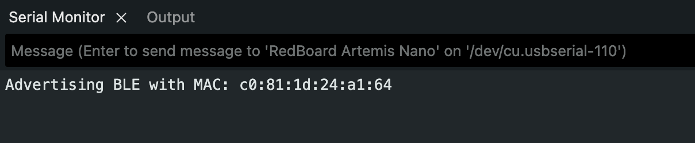

## Configurations ##

In order to ensure that the board and my computer would connect via bluetooth, I copied the MACaddress that was printed in the serial monitor and changed the artemis_address value in connections.yaml to the MACaddress. 

Then, to also ensure I did not accidentally connect to anyone else's board, I generated a new UUID to then paste as the UUID defined as BLE_UUID_TEST_SERVICE in the ble_arduino file and also to replace ble_service in connections.yaml.

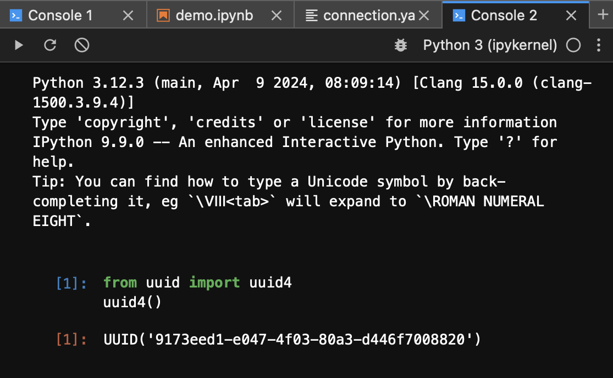
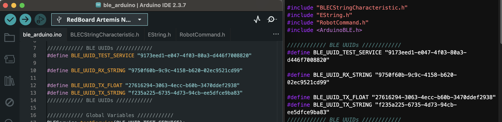

When it finally time to test if I could create a proper connection for the first time, a pop up appeared, asking if I wanted to give the terminal access to bluetooth. Saying yes to that, I was able to connect to the board.

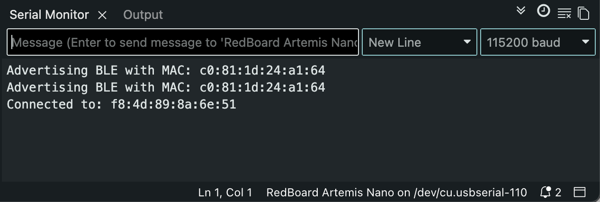

## Tasks ##

#### Echo: ####

Starting in my notebook file, I used the send_command command to call ECHO and input the message I want echoed back as the second argument, sending this to the board for the command handler to handle.

```
#Send string
ble.send_command(CMD.ECHO,"Hello")
```

When it came to the ble_arduino code, I referenced the PING command as that command had a similar purpose of taking a message sent from the computer ("Hello" in this case rather than "PING) and then have the board send a message back to the computer ("Robot says -> Hello :) rather than "PONG"). Thus, I cleared what tx_estring_value was set to, appended the portions of the message I wanted the board to send back. It had to be separated into different calls to append to properly concatenate the normal strings with the char_arr. Then I wrote the value to the tx_characteristic_string so that my computer could access it when it was time to receive the string using the receive_string function.

```
// Append to tx_estring_value
tx_estring_value.clear();
tx_estring_value.append("Robot says -> ");
tx_estring_value.append(char_arr);
tx_estring_value.append(" :)");
tx_characteristic_string.writeValue(tx_estring_value.c_str());

// Print to Serial Monitor
Serial.println(char_arr);
```

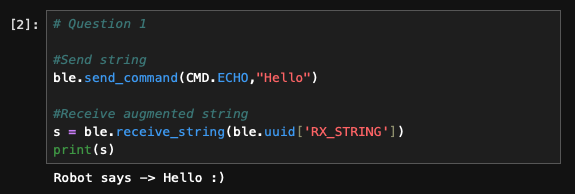

#### Send Three Integers: ####

Here is the function call to send the command to the board along with the three floats--separated by "|"--I want it to extract.

```
ble.send_command(CMD.SEND_THREE_FLOATS, "1.0|-2.0|5.7")
```

For this command, I referenced the command SEND_TWO_INTS where any instance of an int was replaced with a float, and I added one more variable, extraction of the next value from the command string, and serial print statement so that all three floats were extracted and printed. 

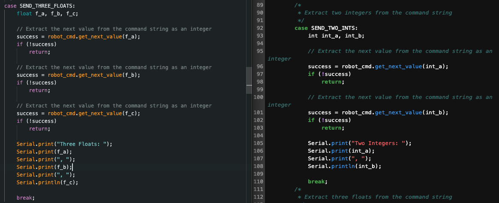

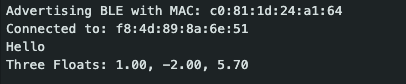

#### GET_TIME_MILLIS: ####

In order to get the time of how long the board had been running in milliseconds, within another case in the switch statement, I utilized similar code to ECHO where I cleared tx_estring_value, appended "T:" as a label for the time, and then appended the time that is returned by millis(). Given millis() returns an unsigned long and I ran into issues appending it, I converted it to an int before ultimately writing the full estring to the characteristic string that will be received and printed by my computer. 

```
tx_estring_value.clear();
tx_estring_value.append("T:");
tx_estring_value.append((int) millis());
tx_characteristic_string.writeValue(tx_estring_value.c_str());
```

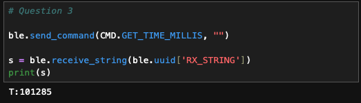

#### Notification Handler: ####

For the notification handler, I created a separate python function that took the characteristic string that was received, converted it from a byte array to the string type that python could work with, and then spliced it to get the time since the characteristic array was received as "T: [Time]." Once the time is extracted, I would print a more detailed message as noted in the code block below. To call the handler, before any commands are called, I called start_notify with the name of the notification handler function as the second argument.

```
def notification_handler(uuid, char_str):
    s = ble.bytearray_to_string(char_str)
    time = s[2:]
    print("Current time is: " + time + " ms")
    
ble.start_notify(ble.uuid['RX_STRING'], notification_handler)
```

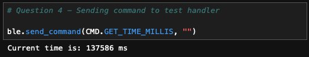

#### Loop Getting Current Time: ####

I added a new command case called LOOP to get the current time over the course of a given number of seconds.

```
ble.send_command(CMD.LOOP, "")
```

I created two new local variables to keep track of the start time of when the command was received by the board and the count in order to count the number of iterations the loop made.

```
// Variables
unsigned long startTime;
startTime = millis();
int count;
count = 0;
```

Then I added a while-loop that would run for 5 seconds as it wrote the current time to the characteristic string for my computer to receive and later print using the notification handler. After the value was written, count was incremented, allowing me to know how many times the current time was written, which was printed to the serial monitor once the command was completed. 

```
// Loop
while ((millis()-startTime) <= 5000){
	tx_estring_value.clear();
	tx_estring_value.append("T:");
	tx_estring_value.append((int) millis());
	tx_characteristic_string.writeValue(tx_estring_value.c_str());
	count++;
}

// Print number of timestamps that was looped through
Serial.print("Number of timestamps: ");
Serial.println(count);
```

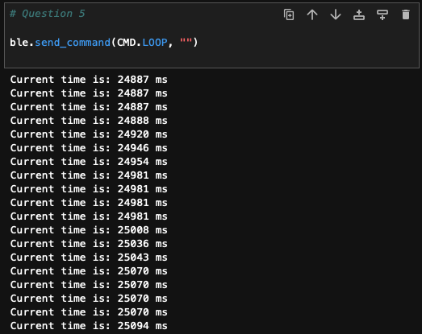

The effective data transfer rate for this command, with 36,193 as my starting value and 41,187 as my end value when I went back to perform this calculation over 248 iterations, is 20.137 milliseconds.

#### Storing and Sending Time Data: ####

As this task did not require printing each time within a message and did require appending to a list, I made another notification handler that only extracted the time and then appended it to a list for time stamps.

```
timeStamps = []

def get_times(uuid, char_str):
    s = ble.bytearray_to_string(char_str)
    time = int(s[2:])
    timeStamps.append(int(time))
```

In the Arduino IDE, I adjusted LOOP to only store the current time into a global array of size 151, which was determined by the MAX_MSG_SIZE and didn't lead to the board disconnecting each time. Also count in this instance was used as an index.

```
while ((millis()-startTime) <= 5000 && count < MAX_MSG_SIZE){
	time = millis();
	timeStamps[count] = millis();
	count++
}
```

Once all the time stamps were stored, I created a new command SEND_TIME_DATA where I looped over the array to write each time to the characteristic string so that my computer could receive it and append it to the python list to ensure that the times were being stored correctly.

```
tx_estring_value.clear();
for (int time:timeStamps){
	tx_estring_value.append(time);
	tx_characteristic_string.writeValue(tx_estring_value.c_str());
}
```

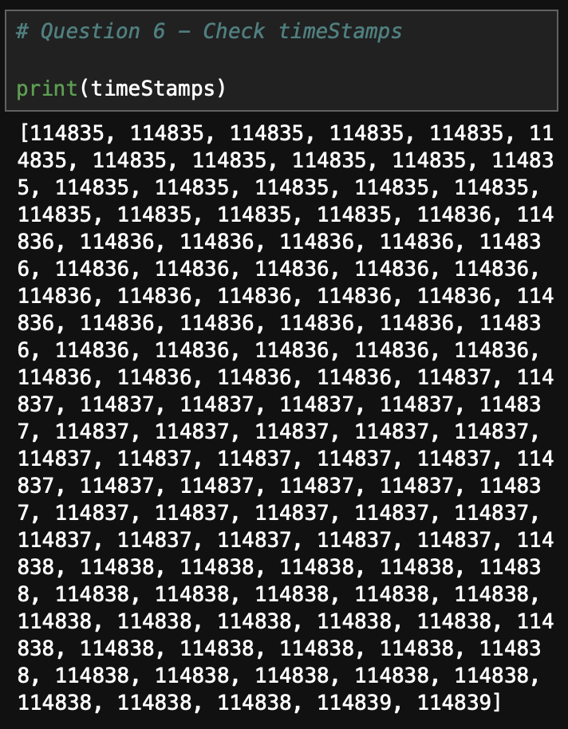

#### Storing and Getting Temperature Readings and Time: ####

Similar to the last task, I created another notification handler function that now had the addition of splitting the received string to extract both time and temperature into separate variables to then append those data points to the correct list.

```
timeStamps = []

temps = []

def get_temp(uuid, char_str):
    s = ble.bytearray_to_string(char_str)
    time, temp = s.split(":")
    timeStamps.append(time)
    temps.append(temp)
    
```

In the IDE, I once again edited the loop to be able to store temperatures that were recorded at each time stamp that was saved into another global array of size 151.

```
while ((millis()-startTime) <= 5000 && count < MAX_MSG_SIZE){
	time = millis();
	temp = getTempDegF();
	temperatures[count] = temp;
	timeStamps[count] = time;
	count++;
}
```

Then in a new command GET_TEMP_READINGS, I looped over both temperature and time stamp arrays at the same time, concatenating them with a colon inbetween before writing it to the characteristic string.

```
tx_estring_value.clear();

for (int i = 0; i < MAX_MSG_SIZE; i++){
	tx_estring_value.append(timeStamps(i));
	tx_estring_value.append(":")
	tx_estring_value.append(temperatures(i));
	tx_characteristic_string.writeValue(tx_estring_value.c_str());
}
```

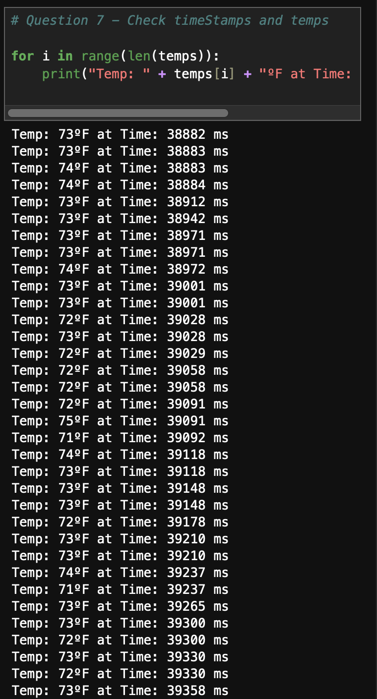

#### Difference in Data Recording Methods... ####

One major difference is the number of arrays looped over and how the computer gains access to the data within the arrays. The method that used SEND_TIME_DATA only loops over one array at a time (the array with time stamps in this case) after having to use another command (LOOP) to fill the array. If this was to send more than just time data, it would take more time to traverse several arrays with the command only focusing on one array at a time. Even with one array, with 114,835 as the start time and 114,839 as the end, data is recorded every 37.75 ms. This method, however, made appending to the list in python and printing the data easier as it is only one piece of data that needs to be extracted at a time, which may only include cutting off a prefix or appending it as is without having to slice any received strings.

On the other hand, the method that used GET_TEMP_READINGS would record and traverse the data quicker as it is appending data to the characteristic string from multiple arrays at the same time rather than going through each array individually. To quantify how quickly it can record and get data, with 151 pieces of data in each array where the first time is 56,948 ms and the last is 56,995 during my testing, the data is recorded every 3.21 ms, much faster than the previous method. This does lead to a more complicated extraction process when receiving the string and wanting to add it to python lists as the received string initially has to be formatted in a way that is easy to slice and get the data without extra characters, and every piece of data needs to be separately stored to then be appended. Part of this may stem from me using the LOOP command to store the values to the arrays first where I had to adjust how I appended the values to be written to the characteristic string. 

With access to 384 kB of space on the Artemis board, I used 46,728 bytes of dynamic memory being used for global variables according to what is printed in the IDE's output when uploading code to the board, which leaves 337,272 bytes of space left. The data being stored in the two arrays are of type unsigned long, which is at least 4 bytes. Thus, dividing the remaining space by 8 bytes (4 bytes for each array) notes that 42,159 data points can be saved without running out of memory on the board.
