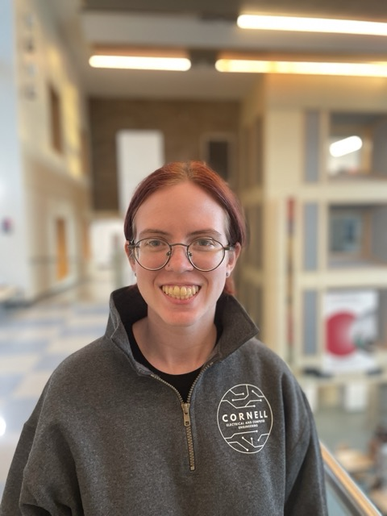

# Bella Barhorst - Fast Robots (ECE4160) #

## About Me ##

Hi, I am Bella Barhorst! I am a senior in ECE with an interest in robotics and computer graphics. Outside of classes, you can find me running the Phoenix Society at Cornell as one of the presidents, helping with the publicity of IEEE at Cornell, and writing, drawing, and gaming in my personal time. 

This website will contain my progress in ECE4160 throughout the spring semester of 2026.

---
## Labs ##

[Lab 1](Lab1.md)
